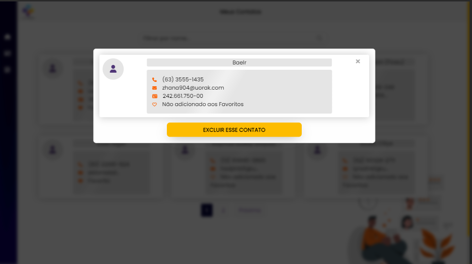

# Agenda de Contatos

Este é um projeto de uma agenda de contatos básica desenvolvida como parte de um teste para um processo seletivo.

## Screenshots

Essas são algumas capturas de tela do projeto para dar uma ideia visual do que você pode esperar.


*"Home" - Contatos Favoritos/tela inicial*


*"Novo Contato" - Cadastro de contatos*


*"Meus contatos" - Todos os contatos*


*Detalhes do contato*

## Funcionalidades

### Página 1: Main (Home)

- Apresenta menu para navegação.
- Destaca os contatos favoritos.
- Permite o filtro dos contatos favoritos utilizando o nome.


### Página 2: Cadastro  (Novo Contato)

- Permite o cadastro de novos contatos com as seguintes informações:
  - Nome;
  - Nome Social (opcional);
  - Apelido (opcional);
  - CPF (opcional);
  - Telefone (Item obrigatório);
  - Email (Item obrigatório);

### Página 3: Grid de Pesquisa com Paginação (Meus Contatos)

- Exibe uma grade de contatos com opção de filtro utilizando o nome.
- Possui paginação para facilitar a navegação.
- Possíbilita a exclusão do contato.

## Validações

- Possui validações para campos obrigatórios: *Nome*, *Telefone* e *E-mail*.

## Tecnologias Utilizadas:
- HTML, CSS, PHP, JavaScript e JQuery.

## Recursos Utilizados

- [Bootstrap](https://getbootstrap.com/): Framework front-end para facilitar o desenvolvimento responsivo e a criação de interfaces atraentes.
- [jQuery](https://jquery.com/): Biblioteca JavaScript para simplificar interações com o DOM e manipulações de eventos.


## Estrutura do Projeto

- 📁 **assets**: Diretório para imagens e outros recursos visuais.
  - **images**: imagens utilizadas no projeto, incluindo a logo.
  - **screenshots**: captura de telas.
 
- 📁 **css**: Contém a folha de estilo (CSS) do projeto.
- 📁 **js**: Armazena os scripts JavaScript, incluindo jQuery.
- 📁 **pages**: Páginas de navegação do projeto.
  - 🗒️ **contatos.php**: página de contatos (*Meus Contatos*).
  - 🗒️**register.html**: formulário para cadastro de novo contato (*Novo Contato*).
- 📁 **includes**: Arquivos adicionais necessários para o funcionamento do projeto.
  - 🗒️ **contatos.txt**: arquivo de texto onde os contatos são armazenados.
  - 🗒️**search.php**: possui a lógica PHP para processar as submissões do formulário de cadastro. Ele interage com um arquivo de texto, onde os dados dos contatos são armazenados.

## Instruções de Uso:
1. Clone este repositório.
   ```bash
   git clone https://github.com/tha-lias/agendaContatos.git

2. Configure seu ambiente PHP.
3. Abra a página `index.php` para começar.


